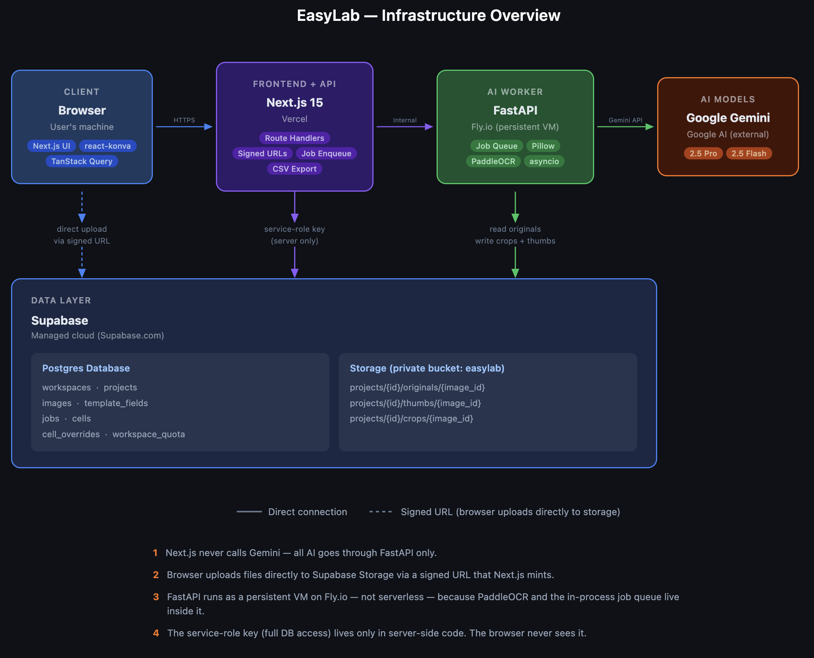
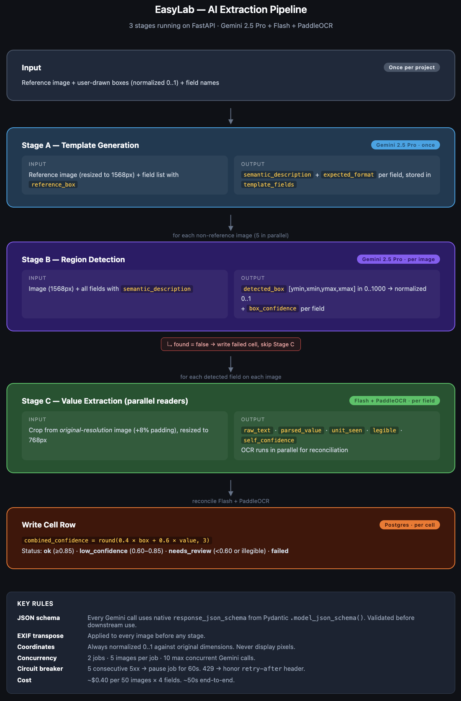

# EasyLab

[](https://github.com/MuratAlkan06/EasyLab/actions/workflows/ci.yml)
[](LICENSE)

Upload a batch of similar lab images, label regions on one reference image, and let AI extract the same fields across all of them into a review table and CSV export.

> **Core idea:** Label one image once → AI learns what each region means → AI finds and extracts the same fields across the rest.

---

## Architecture



Two services + Supabase.

- **`apps/web`** — Next.js 15 on Vercel. Owns UI, signed upload URLs, project/image/field CRUD, job enqueue, CSV export.
- **`apps/worker`** — FastAPI on Fly.io (persistent VM). Owns all Gemini calls, all image processing (Pillow, PaddleOCR), and the in-process asyncio job queue.
- **Supabase** — Postgres for data, Storage for image files (private bucket `easylab`).

The browser uploads files **directly** to Supabase Storage via a signed URL minted by Next.js — uploads never pass through the API. Next.js never calls Gemini; all AI runs on the FastAPI worker.

More diagrams (data flow, ERD, state machines) live in [`docs/diagrams/`](docs/diagrams/index.html).

---

## Repo layout

```
.
├── apps/
│   ├── web/            Next.js 15 (TypeScript, Tailwind, react-konva, shadcn/ui)
│   └── worker/         FastAPI + asyncio (Pydantic v2, asyncpg, Pillow, PaddleOCR)
├── docs/
│   ├── api-contract.md
│   ├── ai-pipeline.md
│   ├── database-schema.md
│   ├── migrations-strategy.md
│   ├── ui-spec.md
│   └── diagrams/       HTML architecture diagrams
├── docker-compose.yml  Local dev (web + worker)
├── CLAUDE.md           Project instructions for Claude Code
└── .env.example        All env vars (Supabase, Gemini, internal secret)
```

---

## Local setup

**Prerequisites:** Node 20+, pnpm 10+, Python 3.13+, Docker, a Supabase project, a Gemini API key.

1. **Clone and install JS deps**
   ```bash
   pnpm install
   ```

2. **Create env files**
   ```bash
   cp .env.example apps/worker/.env
   cp .env.example apps/web/.env.local   # then trim to only the NEXT_* + Supabase vars
   ```
   Fill in: `SUPABASE_URL`, `SUPABASE_SERVICE_ROLE_KEY`, `DATABASE_URL`, `GEMINI_API_KEY`, `INTERNAL_SHARED_SECRET` (`openssl rand -hex 32`).

3. **Run database migrations** (from `apps/worker/`)
   ```bash
   cd apps/worker
   alembic upgrade head
   ```

4. **Start both services**
   ```bash
   docker compose up
   ```
   - Web → http://localhost:3000
   - Worker → http://localhost:8000

   Or run them separately without Docker:
   ```bash
   pnpm dev:web         # Next.js
   pnpm dev:worker      # FastAPI (uvicorn)
   ```

---

## Stack

| Layer | Tools |
|---|---|
| Frontend | Next.js 15, TypeScript, Tailwind, react-konva, shadcn/ui, TanStack Table/Virtual/Query, Zod |
| Backend | FastAPI, Pydantic v2, asyncpg, supabase-py, Pillow, tenacity, structlog |
| AI | Gemini 2.5 Pro (template gen + detection), Gemini 2.5 Flash (extraction), PaddleOCR (parallel reader) |
| Data | Supabase Postgres + Storage, Alembic migrations |
| Export | CSV (XLSX deferred) |

### AI pipeline



Three stages run on the FastAPI worker. Stage A enriches user annotations into a semantic template (once per project). Stage B detects each field's bounding box on every new image. Stage C reads the value from each crop with Gemini Flash and PaddleOCR running in parallel for cross-validation. Every Gemini call uses native JSON schema from Pydantic — no prompt-engineered JSON. See [`docs/ai-pipeline.md`](docs/ai-pipeline.md) for full details.

---

## Build phases

- [x] **Phase 1** — Monorepo scaffold + docker-compose + Supabase migrations + fake job smoke test
- [ ] **Phase 2** — Template generation (Gemini 2.5 Pro adds `semantic_description`)
- [ ] **Phase 3** — Full detection + extraction (review table populates)
- [ ] **Phase 4** — Crops + confidence + `needs_review` flags
- [ ] **Phase 5** — CSV export + `cell_overrides` survive re-runs
- [ ] **Phase 6** — Polish (Realtime, circuit breaker, image validation, quota UI)

---

## Key constraints

- Anonymous workspace per session (HttpOnly signed UUID cookie — no auth in v1)
- Desktop only (≥1280px), JPG/PNG ≤20 MB, 10–50 images, max 20 fields per project
- All bounding boxes stored normalized 0..1, never display pixels
- All Gemini calls use native `response_json_schema` from Pydantic models — no prompt-engineered JSON
- Service-role key is server-side only — never `NEXT_PUBLIC_*`
- Spend controls (per-workspace daily quota + global token budget) gate every job

---

## Documentation

| Doc | When to read |
|---|---|
| [`docs/database-schema.md`](docs/database-schema.md) | Writing migrations, adding columns, understanding state machines |
| [`docs/api-contract.md`](docs/api-contract.md) | Implementing any API route |
| [`docs/migrations-strategy.md`](docs/migrations-strategy.md) | Before running Alembic |
| [`docs/ai-pipeline.md`](docs/ai-pipeline.md) | Implementing any Gemini / OCR / confidence logic |
| [`docs/ui-spec.md`](docs/ui-spec.md) | Implementing any frontend page or canvas interaction |
| [`docs/diagrams/index.html`](docs/diagrams/index.html) | Visual reference — infrastructure, data flow, AI pipeline, ERD, state machines |
